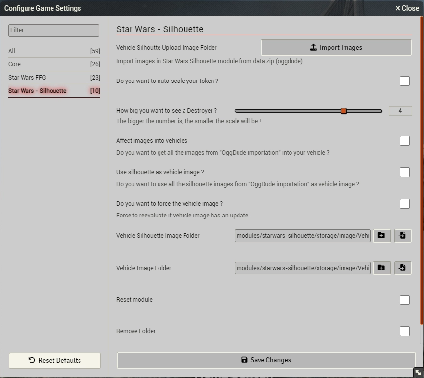

## Star Wars Silhouette Module

* **Author**: .prolice
* **Version**: 
* **Foundry VTT Compatibility**:  to 

* **System Compatibility**:  to  
* **Repository size**: 
* **Download**: 
				 
				
* **Total Download**:  
		
* **Issues**:
		
		
### Link(s) to Module
* [https://github.com/prolice/starwars-silhouette](https://github.com/prolice/starwars-silhouette)

### Description 
Star Wars Silhouette is designed to manage silhouette images in your vehicle actor sheet (planetary or spacial).
It takes the oggdude import id code in your actor item and looking for an image (which is to be upload from oggdude data.zip->vehicle images and data.zip->vehicle silhouette.
to affect it into your actor sheet as the token image and the silhouette as the new silhouette image.

**Features Overview:**
* 

# Image Importation Procedure

This documentation provides a step-by-step guide on how to import images into the application. Before proceeding, ensure that you have imported at least one type of vehicle (Planetary Vehicles or Space Vehicles) using the oggDude importer. Follow the instructions below to ensure a successful image importation process.

## Prerequisite: Importing Vehicles

Before starting the image importation process, make sure you have imported at least one type of vehicle (Planetary Vehicles or Space Vehicles) using the oggDude importer.

## 1. Configuration Settings

1.1 Navigate to the "Configuration Settings" section within the application.

1.2 Choose your destination folders by specifying the path. The default path is `/module/starwars-silhouette/storage/image/...`.

You have the option to create a subdirectory within the destination folder or use the default destination, which already contains two subfolders.

## 2. Image Importation

1.4 Click on the "Import Images" button to initiate the image importation process.

1.5 Load the `data.zip` file obtained from oggDude by selecting it through the file dialog.

1.6 Check all the checkboxes to ensure that all necessary configurations are selected for the importation process.

1.7 Click on the "Start Import" button to begin the importation process.

The application will now proceed to import the images from the `data.zip` file into the specified destination folders. Ensure that you monitor the progress and address any potential errors or warnings that may arise during the importation process.

**Note:** It is recommended to review the application logs or notifications for any detailed information about the importation process, such as success messages or error reports.

Congratulations! You have successfully completed the image importation procedure. If you encounter any issues or have specific questions, refer to the application's documentation or seek assistance from the support team.

### Warning
If you use this module as a "Release Candidate", please be sure that you have made a backup of your world!
There is v1.0.0+, you can use it more safely but still a backup is not too much to be sure ;-)

## Installation
### Auto install Method (recommended)
* Open the Foundry application and click **"Install Module"** in the **"Add-On Modules"** tab.
* Type "Star Wars" in the Filter - window top right - 
* Choose "Star Wars Silhouette"
* Click "Install"
* Activate the module in your World using **Manage Modules** under the **Game Settings** tab and find Star Wars Silhouette.

### Manual Method
* Open the Foundry application and click **"Install Module"** in the **"Add-On Modules"** tab.
* Paste the following link: https://github.com/prolice/starwars-silhouette/raw/starwars-silhouette/module.json
* Click "Install" 
* Activate the module in your World using **Manage Modules** under the **Game Settings** tab and find Star Wars Silhouette.

## Known issues and advices:
* Release Candidate for instance

## Inspired module and code from tiers
* OggDude importer (starwarsffg system): The module Silhouette is using a part of the OggDude Importer code in order to manage the image importation

